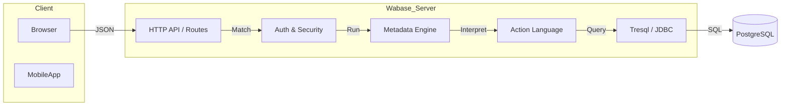

# Wabase Documentation

Welcome to the definitive documentation for **Wabase**, the Scala-based web application framework designed for data-centric RESTful services.

## Overview

Wabase is a "database-first" framework. It assumes your data model (schema) is the source of truth and allows you to build a powerful REST API on top of it using declarative metadata (YAML) and a specialized query language ([Tresql](https://github.com/mrumkovskis/tresql)). It is built on the robust [Apache Pekko™](https://pekko.apache.org/) HTTP stack.

### Key Philosophy
*   **Metadata over Code**: Define *what* you want (views, actions), not *how* to do it.
*   **Hierarchical Data**: Handle complex nested JSON structures that map naturally to relational databases.
*   **Scalability**: Fully asynchronous and non-blocking.

## Documentation Structure

This documentation is divided into four main sections:

### 0. [Feature Guides](features/index.md)
Task-first guides for individual capabilities, so you can jump directly to what you need.
*   [Feature Guides Index](features/index.md)
*   [Feature Catalog](features/00-feature-catalog.md)
*   [Authentication and Sessions](features/01-authentication-and-sessions.md)
*   [CSRF Protection](features/02-csrf-protection.md)
*   [Views, Routes, and CRUD API](features/03-views-routes-and-crud.md)
*   [Action Language Workflows](features/04-action-language-workflows.md)
*   [Deferred Requests](features/05-deferred-requests.md)
*   [Background Jobs and Scheduler](features/06-background-jobs.md)
*   [Auditing](features/07-auditing.md)
*   [Internationalization (I18n)](features/08-internationalization-i18n.md)
*   [Files and Attachments](features/09-files-and-attachments.md)
*   [Templates and Document Generation](features/10-templates-and-document-generation.md)
*   [Email Sending](features/11-email-sending.md)
*   [Outbound HTTP Client Calls](features/12-outbound-http-client-calls.md)
*   [Server Notifications (SSE/WS)](features/13-server-notifications.md)
*   [API Metadata and Swagger](features/14-api-metadata-and-swagger.md)
*   [Request Decoding and Content Types](features/15-request-decoding-and-content-types.md)
*   [Result Rendering and Export](features/16-result-rendering-and-export.md)
*   [Script Validations](features/17-script-validations.md)
*   [Static Resources and Cache Controls](features/18-static-resources-and-cache-controls.md)

### 1. [The Comprehensive Guide](guide/01-setup.md)
A step-by-step tutorial that takes you from an empty project to a full-featured **Task Management System**.
*   [Setup & Installation](guide/01-setup.md)
*   [Basic CRUD](guide/02-basic-crud.md)
*   [Relationships & Validation](guide/03-relationships-and-validation.md)
*   [Files & Attachments](guide/04-files-and-attachments.md)
*   [Custom Actions](guide/05-custom-actions.md)
*   [Background Jobs](guide/06-background-jobs.md)
*   [Security & Roles](guide/07-security.md)
*   [Deployment](guide/08-deployment.md)
*   [Additional Features](guide/09-additional-features.md) (Audit, I18n, CSRF, Notifications, Spreadsheets)

### 2. [Reference](reference/01-views.md)
Detailed technical specifications for every part of the framework.
*   **[Metadata Cheat Sheet](reference/cheat-sheet.md)** (Quick lookup)
*   [View Definition](reference/01-views.md)
*   [Action Language Spec](reference/02-action-language.md)
*   [Tresql Reference](reference/03-tresql.md)
*   [Configuration](reference/04-configuration.md)
*   [Routes Reference](reference/05-routes.md)
*   [Core Runtime & Extension Points](reference/06-core-runtime-and-extension-points.md)
*   [Security, Authentication & CSRF](reference/07-security-authentication-and-csrf.md)
*   [Input/Output & Renderers](reference/08-input-output-and-renderers.md)
*   [Async: Jobs, Deferred, Events, Audit](reference/09-async-jobs-deferred-events.md)
*   [Testing & Verification Playbook](reference/10-testing-and-verification-playbook.md)
*   [Feature Coverage Index](reference/11-feature-coverage-index.md)

### 3. [Internals](internals/architecture.md)
For advanced users who want to understand the engine under the hood.
*   [Architecture Overview](internals/architecture.md)

---

## High-Level Architecture

